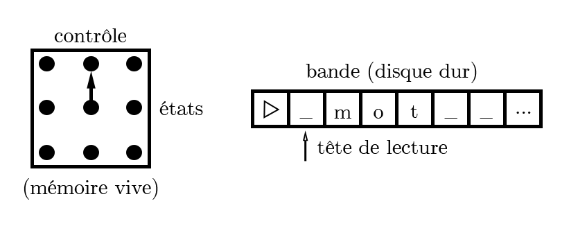
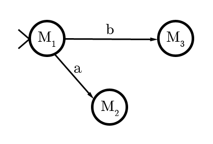
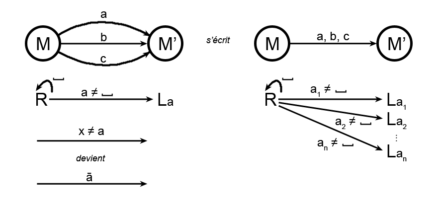
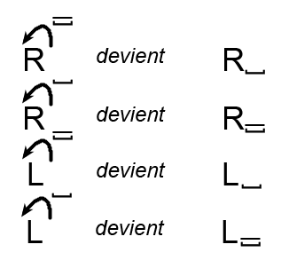
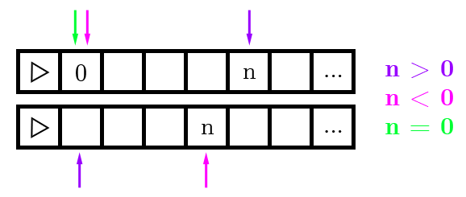

# Complexité et calculabilité

**À propos**

Ce document reprend les notes du cours de Complexité et calculabilité dispensées par [**Christian RONSE**](https://dpt-info.u-strasbg.fr/~cronse/welcome.html) à *l'Université de Strasbourg*.

Mise en forme par [Marek Felsoci](mailto:marek.felsoci@etu.unistra.fr).

**ATTENTION !** L'USAGE DE CE RÉSUMÉ DE COURS NE PEUT ÊTRE QU'ACADÉMIQUE.

## Machines de Turing

### Contrôle avec un nombre fini d'états

Les machines de Turing utilisent une bande ordonnée avec un début mais sans fin où on peut lire, écrire et se déplacer.

### Mécanisme

En fonction de l'état du contrôle et du contenu de la case où se trouve la tête de lecture :

* on passe dans un (nouvel) état
  *et simultanément*
* la tête de lecture soit écrit un caractère dans la case et on ne change rien soit se déplace d'une case à droite ou à gauche

L'alphabet fini &Sigma; utilisé par l'automate contient :

* &#9655; : un symbole de début de bande
* &#8852; : un symbole de blanc
* autres symboles

Souvent l'alphabet &Sigma;0 en entrée/sortie &supe; &Sigma;. Les symboles &rarr; et &larr; codant le déplacement d'une case à droite respectivement à gauche n'appartiennent pas à &Sigma;.

### Définition formelle

Une machine de Turing est un quintuplet (K, &Sigma;, &delta;, s, H) tel que :

* K est un ensemble fini d'états
* s est l'état initial et s &isin; K
* H est l'ensemble d'états d'arrêt et H &sube; K
* &Sigma; est un alphabet fini tel que {&#9655;, &#8852;} &isin; &Sigma; et {&rarr;, &larr;} &notin; &Sigma;
* &delta; est une transition qui correspond à (K - H) &times; &Sigma; &rarr; K &times; (&Sigma; &cup; {&rarr;, &larr;}) se traduisant par (q, a) &#8614; (p, b) où q &isin; (K - H), a &isin; &Sigma;, p &isin; K et b &isin; (&Sigma; &cup; {&rarr;, &larr;})

### Contraintes

Soit &delta; une transition telle que &delta;(q, a) = (p, b).

* Si a = &#9655; alors b = &rarr;.
* Si a &ne; &#9655; alors b &ne; &#9655;.

***Example***

Une machine de Turing effaçant la bande serait définie comme suit :

K = {q0, q1, h}  
s = q0  
H = {h}  
&Sigma; = {&#9655;, &#8852;, a}  
&delta; :

| q | &sigma; | &delta;(q, &sigma;) |
| --- | --- | --- |
| q0 | &#9655; | (q0, &rarr;) |
| q0 | &#8852; | (h, &#8852;) |
| q0 | a | (q1, &#8852;) |
| q1 | &#9655; | (q1, &rarr;)n'arrive jamais |
| q1 | &#8852; | (q0, &rarr;) |
| q1 | a | (q0, a) |

### Configuration

Une configuration représente un couple composé de l'état et le contenu de la bande avec la position de la tête de lecture. Dans la notation (q, &#9655;&#8852; **m** o t) q représente l'état, &laquo; &#9655;&#8852; **m** o t &raquo; est le contenu de la bande jusqu'au dernier symbole différent de blanc et la tête de lecture est positionnée sur **m**.

Il est également possible d'utiliser un triplet (q, w, u) pour décrire une configuration où :

* q &isin; K
* w &isin; &#9655;&Sigma;&rarr;\*
* u &isin; &Sigma;&rarr;\*(&Sigma; - &#8852;)
* la tête de lecture est sur le caractère le plus à droite de *w*
* *u* est le mot à droite de la tête de lecture jusqu'au dernier caractère non-blanc

**Exemples :** (q, &#9655;&#8852; **m** o t) &hArr; (q, &#9655;&#8852; **m**, o t), (q, &#9655;&#8852; m o t &#8852; **&#8852;**) &hArr; (q, &#9655;&#8852; m o t &#8852; &#8852;, &epsilon;)

### Transitions de configuration

Notons (q1, w1, a1, u1) &#8866;M (q2, w2, a2, u2) la transition de configuration entre deux états d'une machine de Turing *M* où q1 &isin; K - H et &delta;(q1, a1) = (q2, b).

Lorsqu'on veut déterminer *w2* et *u2* à partir de *b* il y a trois cas possibles :

1. b &isin; &Sigma; alors *w2* = *w1*, *u2* = *u1* et *a2* = *b*
2. b = &rarr; alors la tête de lecture se déplace d'un cran à droite, *w2* = *w1a1* et :
  * si *u1* = &Sigma; alors *a2* = &#8852; et *u2* = &epsilon;
  * sinon *u1* = *a2u2* &rArr; *a2* = tête de *u1* et *u2* = queue
3. b = &larr; alors la tête de lecture se déplace d'un cran à gauche, *w1* = *w2a2* où *a2* est le dernier caractère de *w1* et *w2* est le mot d'avant,
  * si *a1* = &#8852; et *u1* = &epsilon; alors *u2* = &epsilon;
  * sinon *u2* = *a1u1*

La fermeture transitive de configurations &#8866;M+ signifie qu'il est possible de passer de celle de gauche à celle de droite en un nombre *n* &gt; 0 de transitions.

D'autre part la fermeture réflexive et transitive de configurations &#8866;M\* signifie qu'il est possible de passer de celle de gauche à celle de droite en un nombre *n* &ge; 0 de transitions.

### Composition

Une machine de Turing peut être contruite à partir des machines de Turing de base.

#### Machines de Turing de base

Soit Ma une machine de Turing de base telle que :

* a &isin; &Sigma; &cup; {&rarr;, &larr;}
* K = {s, h}
* &delta;(s,  &#9655;) = (s, &rarr;)
* &delta;(s, x) = (h, a) où x &ne; &#9655;

Ma est alors une machine qui écrit la lettre *a* sur la bande.

Dans la suite on outilisera les abbréviations M&rarr; et M&larr; pour noter les machines de Turing qui déplacent la tête de lecture d'un cran à droite respectivement à gauche sur la bande.

#### Combinaisons

***Exemples***

* On démarre avec M1.
* Si M1 se termine avec *a* sur la tête alors on va sur M2.
* Si M1 se termine avec *b* sur la tête alors on va sur M3.

K = {s, h} &cup; {qa | q &isin; &Sigma; - {&#9655;, &#8852;}}

|q|&sigma;|&delta;|
|---|---|---|
|s|&#9655;|(s, &rarr;)|
|s|&#8852;|(s, &rarr;)|
|s|a &ne; &#9655;, &#8852;|(q0, &rarr;)|
|s|&#9655;|(q0, &rarr;)|
|q0|x &ne; &#9655;|(h, a)| 

***Définition formelle***

On décrit la combinaison des machines de Turing M1, ..., Mn comme suit :

> Mi = (Ki, &Sigma;, &delta;i, si, Hi)

> K = &#8899;ni = 1 Ki &cup; {h\*}

> s = si pour &gt;Mi

> H = {h\*}

Transitions :

> * celles des machines : &delta;i &supe; &#8899;ni = 1 &delta;i
> * entre les machines :
>   * Mi &rarr; Mj, &delta;(hi, &sigma;) = (sj, &sigma;) &and; &sigma; &isin; &Sigma; - {&#9655;}
>   * Mi &rarr;a Mj, &delta;(hi, a) = (sj, a)

> Si aucune flèche ne sort de Mi avec un *a* dessus alors &delta;(hi, a) = (h\*, a).

*****

## Décisions et calcul

### Décision

Partons de la configuration initiale (s, &#9655;**&#8852;**w) où *w* est le mot en entrée. Soit H = {y, n}.

Une configuration d'arrêt sur l'état *y* respectivement sur l'état *n* est dite **acceptante** respectivement **refusante** ou **rejetante**. Une machine de Turing *M* accepte l'entrée *w* tel que *w* &isin; (&Sigma; - {&#9655;, &#8852;})\* si (s, &#9655;**&#8852;**w) &#8866;M\* c'est-à-dire si on aboutit à une configuration acceptante. De même elle le rejette si on aboutit à une configuration rejetante.

En pratique *w* &isin; &Sigma;0\* &sube; &Sigma; - {&#9655;, &#8852;}.

Soit L &sube; &Sigma;0\* un **langage**. On dit que *M* décide *L* si et seulement si &forall;*w* &isin; L, M accepte *w* et &forall;*w* &isin; L&#773; = &Sigma;0\* \\ L, M rejtte *w*. En d'autres termes si *w* fait partie du langage L la machine aboutit à l'état *y* (oui) sinon elle aboutit à l'état *n* (non).

Un langage est **récursif** s'il existe une machine de Turing qui le décide.

***Exemple***

Soit l'alphabet &Sigma;0 = {a, b, c} et L un langage récursif tel que {anbncn | n &isin; &#8469;}

Voici l'évolution du contenu de la bande : *aaabbbccc* &rarr; *$aa$bb$cc* &rarr; *$$a$$b$$c* &rarr; *$$$$$$$$$* &rArr; Y

### Calcul

Soient H = { h } l'ensemble des états d'arrêt, l'alphabet &Sigma;0 &sube; &Sigma; - {&#9655;, &#8852;} et un mot *w* &isin; &Sigma;0\*.

Si pour la configuration de départ (s, &#9655;**&#8852;**w) la machine de Turing s'arrête sur la configuration (h, &#9655;**&#8852;**u) avec *w* &isin; &Sigma;0\* alors *u* est la sortie de la machine de Turing pour l'entrée *w*. Si la machine de Turing est notée M on écrit *u* = M(*w*). Si M ne s'arrête pas sur l'entrée *w* alors M(*w*) n'est pas défini.

Soit *f* : &Sigma;0\* &rarr; &Sigma;0\* une fonction. Une fonction est **récursive** s'il y a une machine de Turing qui la calcule. Dans le cas des fonctions à plusieurs variables il faut un caractère spécial, un séparateur, pour séparer les mots en entrée.

***Exemple***

Addition entière : &Sigma;0 = {0, 1, ;}

> 5 + 7 = 12

> 101;111 &rarr; 1100

Une machine de Turing M calcule *f* : &#8469;k &rarr; &#8469; si pour l'entrée *codage*(x1, ..., xk), M s'arrête sur le mot en sortie *codage*(*f*(x1, ..., xk)).

### Semi-décision

Soient L &sube; &Sigma;0\* tel que &Sigma;0\* &sube; &Sigma; - {&#9655;, &#8852;}.

Une machine de Turing M semi-décide L si et seulement si &forall;*w* &isin; &Sigma;0\*. *w* &isin; L si et seulement si M s'arrête sur l'entrée *w*. En d'autres termes si *w* &isin; L la machine M s'arrête sinon elle boucle. 

Un langage est **récursivement énumérable** s'il existe une machine de Turing qui le semi-décide. Voici quelques propriétés de L :

> Si L est récursif alors L&#773; aussi. Il suffit d'inverser les Y et les N à la sortie de la machine de Turing. 
> Si L est récursif alors L est récursivement énumérable. Autrement dit, on transforme l'état d'arrêt *n* en un état qui boucel sur lui-même : &delta;(*n*, *n* &ne; &#9655;) = (*n*, *x*).

## Extensions de machines de Turing

### Plusieurs bandes

À chaque instant, en fonction de l'état et des caractères lus sur toutes les bandes on passe dans un nouvel état et on effectue une action sur chacune des bandes. Pour *n* bandes la fonction de transition sera de la forme :

> &delta;(q, a1, ..., an) = (p, b1, ..., bn) où ai &isin; &Sigma; et bi &isin; &Sigma; &cup; {&rarr;, &larr;}

Notons la configuration comme suit :

> (q', w1**a1**u1, ..., wn, **an**, un)

Les mots d'entrée et de sortie se trouvent sur la première bande.

Soit M une machine de Turing à *k* bandes. Il existe une machine de Turing standard M' sur un alphabet &Sigma;' tel que &Sigma; &sube; &Sigma;' avec les mêmes états d'arrêt telle que &forall;*x*,*y* &isin; &Sigma;\* M sur l'entrée *x* s'arrêtera sur la sortie *y* si et seulement si M' sur la sortie *x* s'arrêtera sur *y* avec le même état d'arrêt.

#### Compléxité

Si M le fait en *t* étapes, M' le fait en &Theta;(*t*(|*x*| + *t*)).

Les séries binaires indiquent la position de la première respectivement de la deuxième tête de lecture sur les bandes.

#### Application théorique de deux bandes

Un langage L est récursif si et seulement si L et L&#773; sont tous les deux récursivement énumérables.

***Démonstration***

**&rArr; :** Si L est récursif alors L&#773; l'est aussi. De plus si L et L&#773; sont récursifs alors ils sont également récursivement énumérables.

**&lArr; :** Soient M1 qui semi-décide L, K1, H1 = {h1} et M2 qui semi-décide L2, K2, H2 = {h2}. 

On démarre avec &#9655;**&#8852;**w sur chaque bande. M est une machine de Turing à deux bandes telle que K = (K1 &times; K2) &cup; {*y*, *n*} et ayant les transitions suivantes :

> Soient deux états non-terminaux q1 &isin; K1 - H1 et q2 &isin; K2 - H2.

> &delta;(q1, a1) = (p1, b1), &delta;(q2, a2) = (p2, b2)

> &delta;((q1, q2), a1, a2) = ((p1, p2), b1, b2)

> &delta;((h1, q2), a1, a2) = (y, a1, a2)

> &delta;((q1, h2), a1, a2) = (n, a1, a2)

### Bande infinie des deux cotés

Dans ce cas il n'y a plus besoin du symbole de début de bande. Il est possible de simuler cette construction par une machine de Turing à 2 bandes finies ayant des numéros de cases dans &#8484;.

### Multiples têtes

**Remarque :** Pour remédier au problème lorsque deux têtes de lecture se trouvent sur une seule et même case on peut utiliser des bandes en deux dimensions.

Toute fonction décidée ou semi-décidée par les machines de Turing avec variantes peut l'être par une machine de Turing standard.

De même si la compléxité d'une fonction décidée ou semi-décidée par une machine de Turing avec variantes est polynomiale elle le sera aussi avec une machine de Turing standard étant donné qu'en remplaçant des variables d'un polynôme par des polynômes on obtient toujours un autre polynôme.

## Machines de Turning non-déterministes

La fonction de transition &delta; est remplacée par une relation &Delta; telle que &Delta; &sube; (K - H) &times; &Sigma; &times; K &times; (&Sigma; &cup; {&rarr;, &larr;}) où (K - H) est l'ensemble des états non-terminaux, &Sigma; est le contenu de la bande, K le nouvel état et (&Sigma; &cup; {&rarr;, &larr;}) l'action à effectuer sur la bande.

Alors &Delta;(*q*, *a*, *p*, *b*) signifie que si on est dans l'état *q* &notin; H et qu'on lit *a* sur la bande alors on peut aller dans l'état *p* et faire *b* sur la bande.

|*q*|*a*|(*p*, *b*)|
|---|---|---|
|...|...|...|

Soit &#8866; le symbole de transition alors C &#8866; C' veut dire que l'on peut aller de la configuration C à la configuration C'. À partir d'une configuration intiale on obtient par dérivation une arborescence de configurations :

*Notations*

* *s* : configuration initiale
* *w* : partie du mot déjà lue
* *v* : partie du mot à droite de la tête de lecture

On note *r* le nombre maximum de choix qu'on peut avoir à chaque configuration tel que *max*(*Card*({(*p*, *b*) &isin; K &times; (&Sigma; &cup; {&rarr;, &larr;} | &Delta;(*q*, *a*, *p*, *b*)}))), (*q*, *a*) &isin; (K - H) &times; &Sigma;.

Soit M une machine de Turing non-déterministe. M accepte le mot *w* si pour un *h* &isin; H et *v*, *u* &isin; &Sigma;\*, a &isin; &Sigma; on a (s, &#9655;**&#8852;**w) &#8866; (h, v**a**u). Autrement dit, pour une succession de dérivations on peut à partir d'une configuration initiale aboutir à une configuration terminale.

M décide le langage L si pour tout mot *w* en entrée :

* il existe un *n* &isin; &#8469; fonction de *w* et de M pour lequel il n'y a pas de configuration C avec (*s*, &#9655;**&#8852;** *w*) &#8866;n C,
* *w* &isin; L &hArr; &exist; *u*, *v* &isin; &Sigma;\*, a &isin; &Sigma;, (s, &#9655;**&#8852;**w) &#8866;\* (y, v**a**u) (au moins une dérivation aboutit à *y*, sinon elles sont toutes à *n*).

*Arborescence de configurations*

Si *w* &isin; L alors &exist; une feuille *y*, sinon toutes les feuilles donnent *n*.

M semi-décide L pour tout mot *w* en entrée si *w* &isin; L &hArr; &exist; *u*, *v* &isin; &Sigma;\*, a &isin; &Sigma;, (s, &#9655;**&#8852;**w) &#8866;\* (h, u**a**v) (au moins une dérivation aboutit à l'arrêt).

### Calcul d'une fonction *f*

*Conditions*

1. Comme pour la décision.
2. (*s*, &#9655;**&#8852;**w) &#8866;\* (h, u**a**v) &hArr; u**a**v) = &#9655;**&#8852;** *f*(w)

Tout langage décidé ou semi-décidé et toute fonction calculée par une machine de Turing non-déterministe l'est aussi par une machine de Turing déterministe. Si la machine de Turing non-déterministe décide en temps *t*, la machine de Turing déterministe décide en temps O(r*t*) (en faisant toujours un parcours en largeur).

L'idée du non-déterminisme est que si on a beaucoup de chance on trouve le résultat en temps polynomiale sinon en temps exponentiel (plus exactement factoriel mais comparable à l'exponentiel via la formule de Sterling) car il y a un long parcours de possibilités à effectuer.
